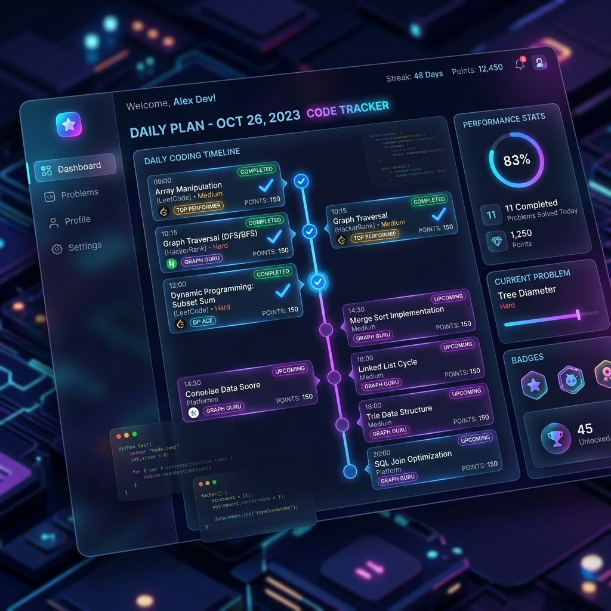

<div align="center">

# 🚀 Striver A2Z DSA Tracker Replica




*A premium, beautifully designed, and distraction-free tracker for the ultimate DSA curriculum.*

</div>

---

## 🎯 What is the Striver A2Z DSA Sheet?

The **A2Z DSA Sheet** (originally created by Raj Vikramaditya, a.k.a Striver) is one of the most popular and highly structured curriculums for mastering Data Structures and Algorithms. It is broken down into **19 meticulously ordered Steps** containing over 400 carefully curated problems. 

The sheet takes you from extreme basics (like "Learn Basic Maths") all the way to advanced interview concepts like Dynamic Programming, Tries, and Advanced Graphs.

## 🛠 Why I Built This Replica (The Problem)

I was religiously following the classic 19-step A2Z Sheet to prepare for interviews. However, a recent website redesign heavily disrupted the learning experience. The beautiful, straightforward progression of **Concept ➔ Video ➔ Article ➔ Practice Platform** was replaced, and the original problem structure became chaotic with the addition of embedded online IDEs and shuffled lists.

I couldn't focus. I just wanted my raw roadmap back.

So, I built my own **A2Z DataSheet Replica** to fix this. I scraped community archives to restore the pristine **402-problem, 19-step curriculum**. I stripped away the built-in IDEs, added back the native GFG and LeetCode progression, and enhanced it with dedicated Codeforces competitive programming routines.

## ✨ Features of My Tracker

This isn't just a simple checklist; it is a full-fledged, privacy-first Learning Management System (LMS) built directly into your browser.

- 📊 **Master Roadmap Dashboard**: View your overall "A2Z Progress" curriculum mastery, your Competitive Programming readiness, and your consecutive Daily Streak in a unified, beautiful glass-morphic dashboard.
- 📅 **The Ultimate Daily Plan Engine**: An algorithm that generates a date-locked, 3-Phase daily workout:
  - **Phase 1 (Muscle Memory)**: Learn concepts, watch videos, and solve 3 A2Z problems from your current topic.
  - **Phase 2 (Logic & Speed)**: Solve 1 dynamically generated Codeforces task related to your topic.
  - **Phase 3 (Spaced Repetition)**: Automatically reviews an old problem you flagged as "Needs Review" or previously solved to ensure you retain mastery.
- 🔍 **Problem Bank (Search & Filters)**: Instantly search through all 402 problems. Filter by Platform (LeetCode, GFG, TakeUForward), Difficulty (Easy/Medium/Hard), or Status (Solved, Unsolved, Bookmarked, Needs Review).
- 🧠 **Comprehensive Problem Tracking**: Don't just mark problems as "solved." You can **☆ Bookmark** them, flag them for **🔁 Review**, and even write your own **📝 Personal Notes** (e.g. *"Use a hashmap to achieve O(n) time complexity"*) directly inside the problem row.
- 🔗 **Data Correctness & Native Progression**: Restored the missing GeeksForGeeks problems and fixed broken duplicate URLs from the original dataset. Every problem now features native, clickable inline buttons: `[ 🎥 Watch Video ] [ 📖 Read Article ] [ 💻 Solve ]`.
- 🔐 **100% Privacy & Data Ownership**: No logins required. Your progress is stored securely in your browser's `localStorage`. The **Settings** tab allows you to natively Export your entire progress as a JSON backup and Import it to any other device or browser.
- 🌐 **Shareable URLs & Accessibility**: Built with URL-hash routing (e.g. `/#step-15`), meaning you can share direct links to specific steps. The entire app is fully keyboard accessible (`Tab` and `Enter` ready).
- 🎨 **Premium UI/UX Aesthetics**: Designed with modern visual principles—vibrant gradients, fluid micro-animations, glassmorphism overlays, and curated custom SVG icons to make staring at DSA actually enjoyable.

---

## 🚀 Run It & Deploy It

### Run Locally
Want to use it yourself? You can clone it and run it locally in seconds:

```bash
git clone https://github.com/adilsukumar/A2Z-DataSheet-Replica.git
cd A2Z-DataSheet-Replica
npm install
npm run dev
```

### 🌍 Deploy Instantly to Vercel
You can easily deploy this exact tracker to Vercel for free so you can access your roadmap from anywhere on your phone or laptop. 

Just run:
```bash
npx vercel --prod
```
*(Or click "Import Project" on the Vercel dashboard and paste the link to this GitHub repository!)*

---

<div align="center">
  <i>Built to keep the grind pure. Happy Coding! 💻</i>
</div>
